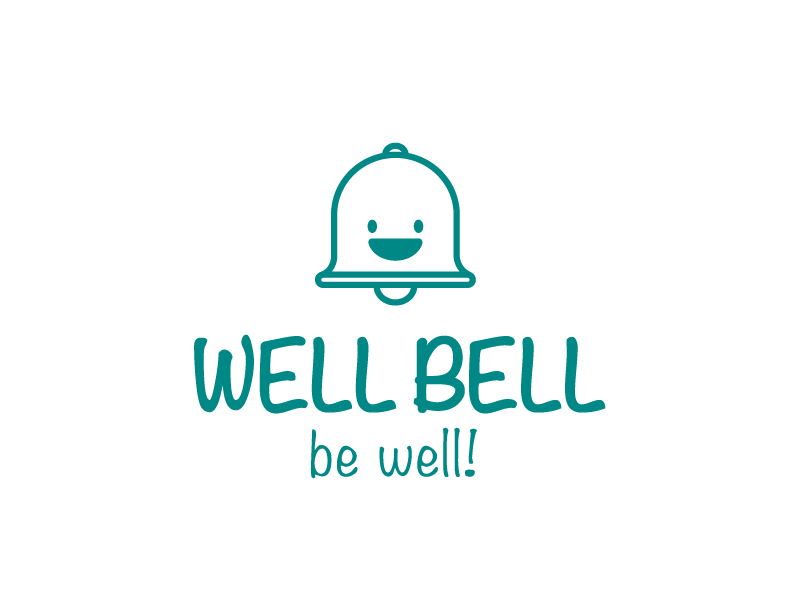

# WellBell Wellness App
Helping you take care of you - anywhere, anytime
WellBell is a digital application designed to help you unplug from your daily grind and reconnect with your wellbeing.

## Overview

Our WellBell App is for anyone Working From Home with long hours on the computer. Users set Bell reminders based on their preference of Physical, Nutritional and Mental/Self-Care. These Bells build better work habits over time, leading to a healthier, happier user and creating an optimal work life balance!
According to the American Psychiatric Association, the majority of employees working from home have reported experiencing negative mental health impacts. WellBell is here to step in and help you take care of you with daily physical, nutritional and self care reminders!

### Our Team - Our Inspiration
Co-Leader: Spencer Simon

  
  

Co-Leader: Kenyetta Griffin

  
  

Note Taker: Zane Ahmed

  
  

Facilitator: Jede Brahma

  
  

Arbitrator: John Prado

  
  

## Technologies
* Languages
    * JavaScript
    * HTML
    * CSS

* Libraries
    * React
    * Express
    * Node.js
    
* Third Party APIs
    * Firebase

* Database
    * Node.js
    * PostgreSQL

* User Stories
    * Maria - Single Mother

* Future Goals
    * Implement Haptic Feedback System
    * Tracking A User's Bells and Their Preferences - Creating Promotional Partnerships to Provide Rewards as Incentives
    * Partner Up With Companies & Integrate Into Employment (Employee Assistance Program)
    
### Deployment
    * IN THE WORKS - WORKING ON IT TONIGHT!
